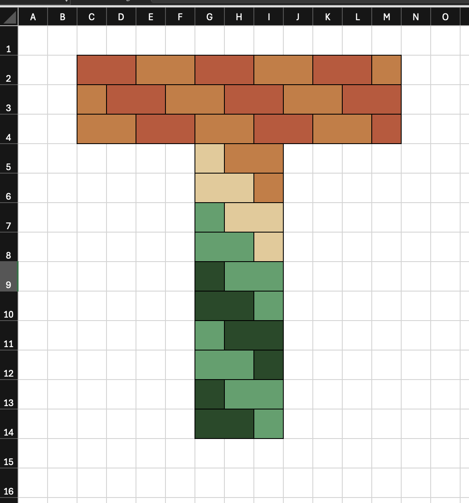
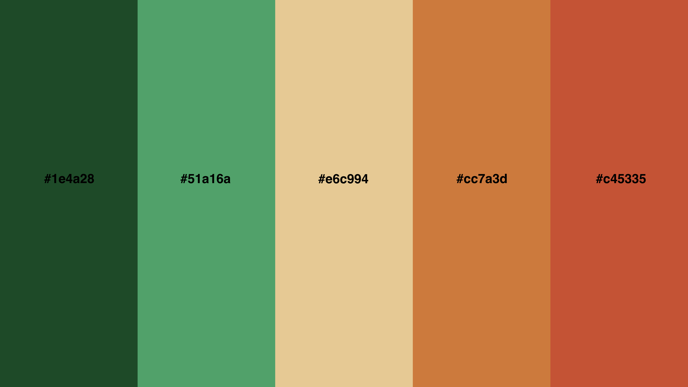
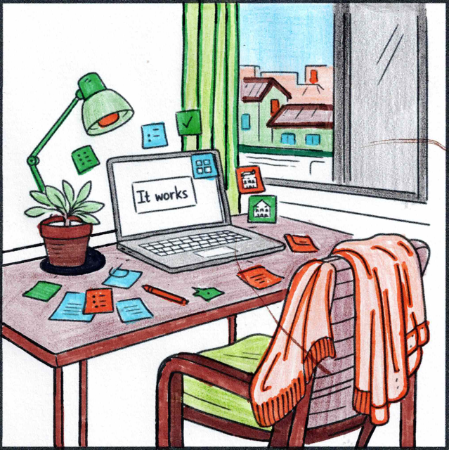

# How Thin Walls Took Shape

Thin Walls is a platform designed to help people better understand the realities of sound in multi-dwelling environments such as apartments, townhouses, hotels, and student accommodation.

The Thin Walls logo that you see being used throughout the platform was made by me on a Saturday morning, using Microsoft Excel. Yup, I created the logo with coloured cells, block by block to form the "T" shape. I think that's pretty cool.

Its shape carries the Thin Walls idea in miniature form. The coloured bricks form a **T**: the letter represents *Thin*, while the brick layout represents *Walls*.

The logo was exported as a PNG that very same day, on Saturday, 14 September 2024 at 11:22.

The brand colours took shape on the same day too:

- `#1e4a28`
- `#51a16a`
- `#e6c994`
- `#cc7a3d`
- `#c45335`

The greens represent nature, the orange tones echo the colour of bricks, and `#e6c994` bridges the two sides of the [palette](https://colorkit.co/palette/1e4a28-51a16a-e6c994-cc7a3d-c45335/).

On 11 November 2024, the purchase of `thinwalls.life` gave this project a public home. The name draws on the familiar way we describe poor sound insulation in our homes: we say the walls are thin. The `.life` recognises that this experience goes beyond a building problem. It affects our lives and the lives of the people around us.

## Turning research into something tangible

With a name, an identity and a public home in place, I began to do research. The core research came together in January 2025, with some additional material added in February 2025. It explored sound, privacy, anxiety, neighbour dynamics, building standards and the ways people could regain a sense of control in their homes.

The research was used to power educational blog posts that appear on the Thin Walls website.
I published the first blog post on 11 February 2025, [Understanding STC Levels](https://www.thinwalls.life/blogs/understanding-stc-levels).

In June and July 2025, the research moved into a physical form through a series of [downloadable Thin Walls zines](https://www.thinwalls.life/#zines). 

The zines give a difficult topic a simple route into everyday conversation. A zine can be downloaded, printed and passed to a neighbour, friend or family member. It makes room to discuss thin walls in a casual, low-conflict way.

## A visual language made by hand

I enjoy colouring in images as one of my hobbies. To weave some of that creativity into the platform, I used ChatGPT to create AI-generated colouring images. They are all themed around life in multi-dwelling buildings. I coloured the images by hand using mostly the brand's palette, scanned, cropped and then reused them as blog thumbnails and other website visuals.

Here's one that I'm looking forward to using soon 

## The point where this chapter ends

Development of the Thin Walls mobile app began on 19 December 2025. API development followed on 24 December 2025.

Looking back, Thin Walls didn’t suddenly become real when I started writing code. Each smaller act - making the logo, gathering research, publishing articles, folding zines and colouring images - gave the idea a little more shape. By December 2025, the software already had something real to grow from.

That is where this part of the story ends. The app and API deserve their own posts, with their own decisions, constraints and lessons.
